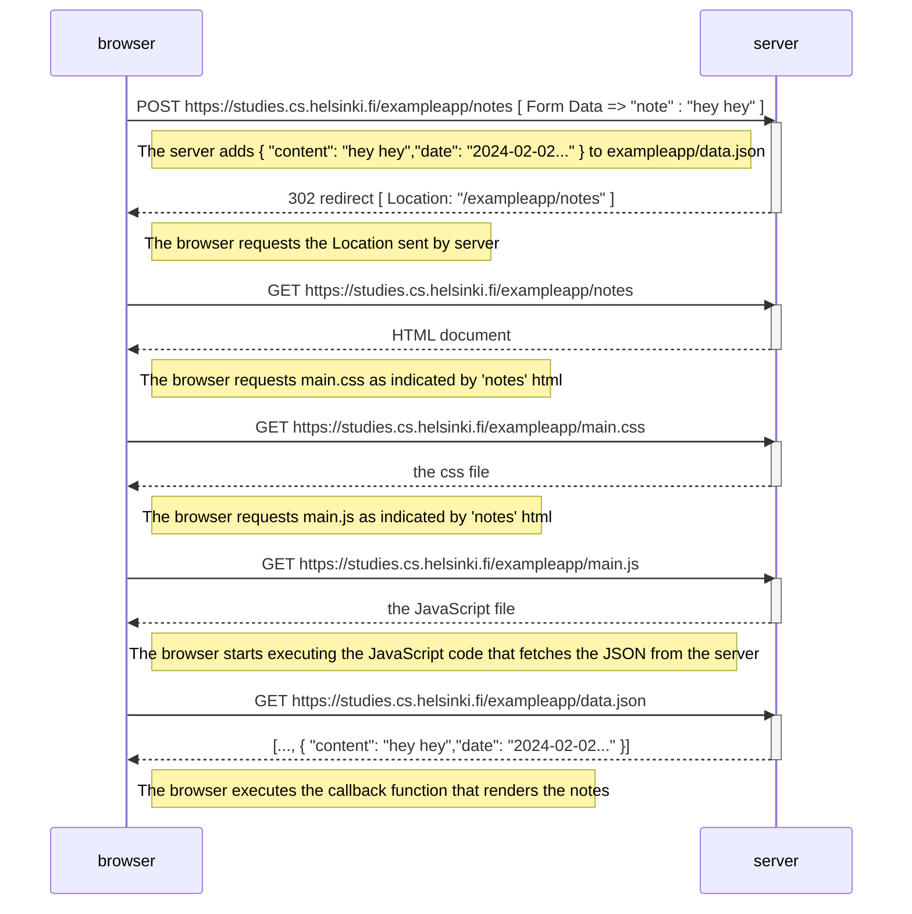

```mermaid
sequenceDiagram
    participant browser
    participant server

    browser->>server: POST https://studies.cs.helsinki.fi/exampleapp/notes [ Form Data => "note" : "hey hey" ]
    activate server

    Note left of server: The server adds { "content": "hey hey","date": "2024-02-02..." } to exampleapp/data.json

    server-->>browser: 302 redirect [ Location: "/exampleapp/notes" ]
    deactivate server

    Note right of browser: The browser requests the Location sent by server

    browser->>server: GET https://studies.cs.helsinki.fi/exampleapp/notes
    activate server
    server-->>browser: HTML document
    deactivate server

    Note right of browser: The browser requests main.css as indicated by 'notes' html

    browser->>server: GET https://studies.cs.helsinki.fi/exampleapp/main.css
    activate server
    server-->>browser: the css file
    deactivate server

    Note right of browser: The browser requests main.js as indicated by 'notes' html

    browser->>server: GET https://studies.cs.helsinki.fi/exampleapp/main.js
    activate server
    server-->>browser: the JavaScript file
    deactivate server

    Note right of browser: The browser starts executing the JavaScript code that fetches the JSON from the server

    browser->>server: GET https://studies.cs.helsinki.fi/exampleapp/data.json
    activate server
    server-->>browser: [..., { "content": "hey hey","date": "2024-02-02..." }]
    deactivate server

    Note right of browser: The browser executes the callback function that renders the notes
```