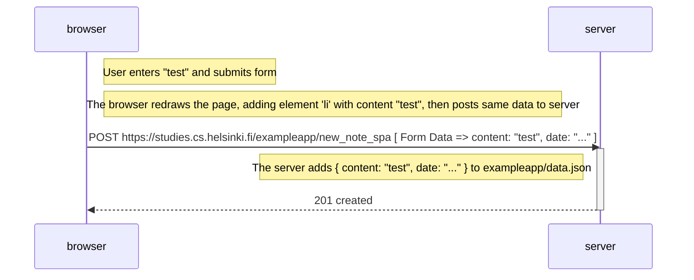

```mermaid
sequenceDiagram
    participant browser
    participant server

    Note right of browser: User enters "test" and submits form
    Note right of browser: The browser redraws the page, adding element 'li' with content "test", then posts same data to server
    browser->>server: POST https://studies.cs.helsinki.fi/exampleapp/new_note_spa [ Form Data => content: "test", date: "..." ]
    activate server

    Note left of server: The server adds { content: "test", date: "..." } to exampleapp/data.json

    server-->>browser: 201 created
    deactivate server
```